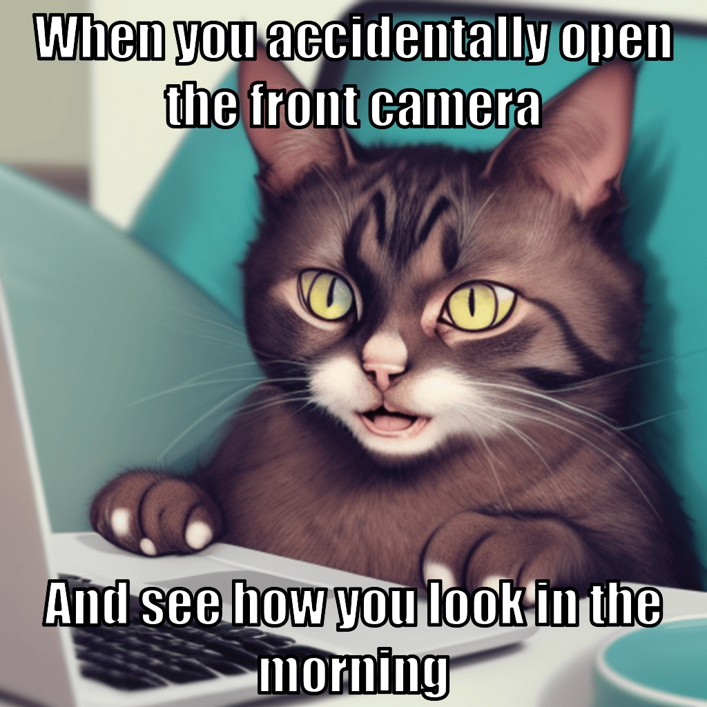

# AI Generated Memes
Generating memes using Bing AI, Stable Diffusion WebUI, and the `shitpost` CLI tool.

## Prerequisites
1. Install the [Stable Diffusion WebUI](https://github.com/AUTOMATIC1111/stable-diffusion-webui) together with any model you like, then run it with the `--api` command line option.
2. Install a CLI tool that can generate memes. Easiest is to use `shitpost` for Linux (available in the AUR and probably for Ubuntu as well). Alternatively, you could use `memegen` for MacOS ([click here for instructions](https://github.com/cmdrkeene/memegen)), but it requires slight code changes.
3. Add your `_U` Bing AI token as an environment variable named `BING_AI`. Check [here](https://github.com/waylaidwanderer/node-chatgpt-api) for more instructions.
4. Run the tool using `node src/bing-memes.js` (assuming you installed NodeJS, if not, please do :D).
5. Sell the memes on any NFT broker.
6. Stonks.

## Code structure
For this project, I opted for a single code file: `src/bing-memes.js`. I made some convenience functions for chatting with Bing, extracting its output, and generating Stable Diffusion images with the WebUI. Then I just loop semi-endlessly to make Bing generate endless memes.

## Example output
Demo output for 300 memes can be found in the `demo-output/` folder. Here are some I consider funny:

## Final note
Elon open-sourcing the Twitter algorithm? Well, Elon, take this! Unlimited dank memes! You have nothing on me... except for a few billions in cash :D
